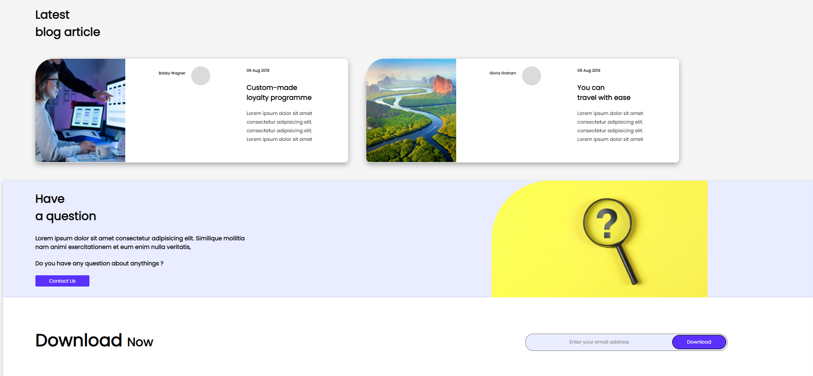

## Name- Anurag Pathak

## Hashnode link- [Markdown guide](https://img.shields.io/badge/project-developer%20landingpage-green)

# Developer landing page.
 In this Developer landing page project I used html and css and it looks more perfect than previous one I learn more about flexbox and others properties of css. Thanks to the Inueron team. 
# Skills.
* HTML
* CSS

# Time.
12 hours

# Learn from the project.
* Designing button
* card using flexbox
* positions
* CSS text
* css colors
* Box model

# Screenshot of project.

## Thanks to-

